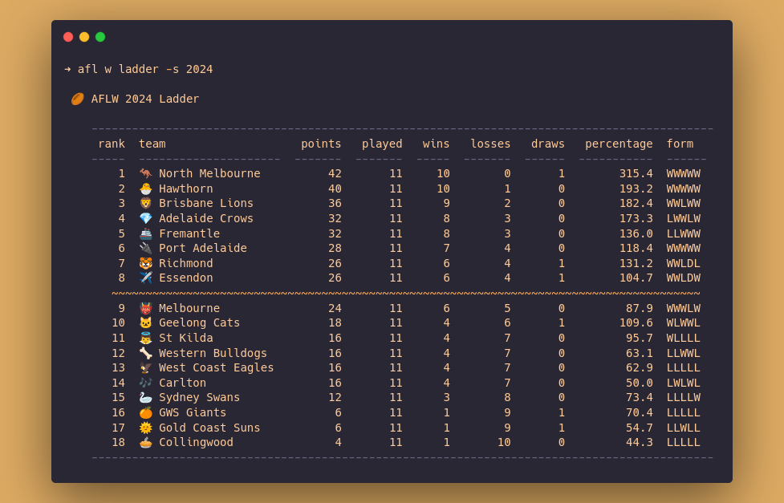

# AFL CLI

A command line interface to view standings and live scores for [AFLW (Australian Football League Women's)](https://en.wikipedia.org/wiki/AFL_Women's) and [AFL (Australian Football League Men's)](https://en.wikipedia.org/wiki/Australian_Football_League).




## Installation (Linux/Mac)

You'll need [R](https://www.r-project.org/) installed on your machine, as well as the following packages: [`fitzRoy`](https://github.com/jimmyday12/fitzRoy), [`docopt`](https://github.com/docopt/docopt.R) , [`memoise`](https://memoise.r-lib.org/), [`cachem`](https://cachem.r-lib.org/), [`glue`](https://glue.tidyverse.org/),  [`dplyr`](https://dplyr.tidyverse.org/), [`knitr`](https://github.com/yihui/knitr).

Clone this repository.

```shell
git clone https://github.com/jackhiggins458/afl_cli
```

Make `afl.R` executable.

```shell
cd afl_cli
chmod +x afl.R
```

If you want to be able to run  `afl <command>` from any directory on your system, you can point a [symlink](https://en.wikipedia.org/wiki/Symbolic_link) to `afl.R` from a directory in your `$PATH`. I recommend placing the link in something like `/usr/local/bin`, but you can choose any directory in `$PATH`. 

For example, from the `afl_cli` directory, run the following.

```shell
ln -s afl.R /usr/local/bin/afl
```


## Usage

```shell
> afl --help
# A cli for viewing AFL(W/M) data
#
# Usage:
#   afl (w|m) ladder [--season <year>]
#   afl (w|m) fixture [--season <year>] [--round <round>]
#   afl (w|m) results [--season <year>] [--round <round>]
#   afl (w|m) live

# Options:
#  -h --help              Show help.
#  -s --season <year>     Season [default: current]
#  -r --round <round>     Round of season [default: current]
```

To view the ladder for the 2024 AFLW competition, use the `afl w ladder -s 2024` command.

```shell
> afl w ladder -s 2024
#
# 🏉 AFLW 2024 Ladder 
#
#    -------------------------------------------------------------------------------------------- 
#     rank  team                    points   played   wins   losses   draws   percentage  form  
#    -----  ---------------------  -------  -------  -----  -------  ------  -----------  ------
#        1  🦘 North Melbourne          42       11     10        0       1        315.4  WWWWW 
#        2  🐣 Hawthorn                 40       11     10        1       0        193.2  WWWWW 
#        3  🦁 Brisbane Lions           36       11      9        2       0        182.4  WWLWW 
#        4  💎 Adelaide Crows           32       11      8        3       0        173.3  LWWLW 
#        5  🚢 Fremantle                32       11      8        3       0        136.0  LLWWW 
#        6  🔌 Port Adelaide            28       11      7        4       0        118.4  WWWWW 
#        7  🐯 Richmond                 26       11      6        4       1        131.2  WWLDL 
#        8  ✈️ Essendon                 26       11      6        4       1        104.7  WWLDW 
#       ~~~~~~~~~~~~~~~~~~~~~~~~~~~~~~~~~~~~~~~~~~~~~~~~~~~~~~~~~~~~~~~~~~~~~~~~~~~~~~~~~~~~~~~ 
#        9  👹 Melbourne                24       11      6        5       0         87.9  WWWLW 
#       10  🐱 Geelong Cats             18       11      4        6       1        109.6  WLWWL 
#       11  👼 St Kilda                 16       11      4        7       0         95.7  WLLLL 
#       12  🦴 Western Bulldogs         16       11      4        7       0         63.1  LLWWL 
#       13  🦅 West Coast Eagles        16       11      4        7       0         62.9  LLLLL 
#       14  🎶 Carlton                  16       11      4        7       0         50.0  LWLWL 
#       15  🦢 Sydney Swans             12       11      3        8       0         73.4  LLLLW 
#       16  🍊 GWS Giants                6       11      1        9       1         70.4  LLLLL 
#       17  🌞 Gold Coast Suns           6       11      1        9       1         54.7  LLWLL 
#       18  🥧 Collingwood               4       11      1       10       0         44.3  LLLLL 
#    -------------------------------------------------------------------------------------------- 
```

To view the fixture for this week's round in the AFL, run `afl m fixture`.

```shell
> afl m fixture
#
# 🏉 AFLM 2025 Round 12 Fixture 
#
#    ---------------------------------------------------------------------------------------------------------------------------- 
#    when                   home                   away                ground                 where           country            
#    ---------------------  ---------------------  ------------------  ---------------------  --------------  -------------------
#    Thu, May 29 at 19:30   🦁 Brisbane Lions      ✈️  Essendon         Gabba                  Brisbane        Yuggera - Toorabul 
#    Fri, May 30 at 19:40   🥧 Collingwood         🐣 Hawthorn         MCG                    Melbourne       Wurundjeri         
#    Sat, May 31 at 13:20   🌞 Gold Coast Suns     🚢 Fremantle        People First Stadium   Gold Coast      Yugambeh           
#    Sat, May 31 at 16:15   🍊 GWS Giants          🐯 Richmond         ENGIE Stadium          Sydney          Wangal             
#    Sat, May 31 at 19:35   🦢 Sydney Swans        💎 Adelaide Crows   SCG                    Sydney          Gadigal            
#    Sun, Jun  1 at 15:20   👹 Melbourne           👼 St Kilda         TIO Traeger Park       Alice Springs   Arrernte           
#    Sun, Jun  1 at 19:20   🦅 West Coast Eagles   🐱 Geelong Cats     Optus Stadium          Perth           Whadjuk            
#    ---------------------------------------------------------------------------------------------------------------------------- 
```


## To Do

- [ ] Finish implementing  `afl (w|m) live` .
- [ ] Finish implementing  `afl (w|m) results` .
- [ ] Test `afl (w|m) live` .
- [ ] Test `afl (w|m) results` .

- [ ] Add extra output options (e.g. compact tables).
